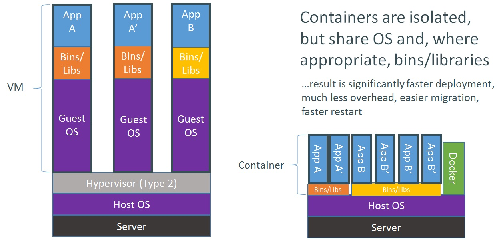

##讨论课－复用解决方案

###容器技术

####容器技术的概念

容器将应用程序和库及其运行所需的其它二进制文件打包在一起，从而为应用程序提供了一个独立的操作系统环境。

这样有效避免了那些依靠底层宿主机操作系统关键组件的应用程序之间存在的冲突。

####容器技术的优势

#####安全与隔离

容器为应用程序提供了隔离的运行空间：每个容器内都包含一个独享的完整用户环境空间，并且一个容器内的变动不会影响其他容器的运行环境。

云计算中的容器指的就是对计算资源（CPU、内存、磁盘或者网络等）的隔离与划分。云计算的本意就是把一大片计算机抽象为一个巨大的资源池，然后使用者人可以不用关心这个资源池里到底有多少物理机器，他只用知道这个资源池总共有多少内存，多少CPU，然后按需申请就可以了。 

#####可移植性与环境的一致性

开发工程师使用docker完成应用开发后build一个docker image，基于这个image创建的container像是一个集装箱，里面打包了各种“散件货物”，比如运行应用所需的程序，组件，运行环境，依赖。

无论是处于开发环境、测试环境还是生产环境，都确保容器内环境一致，软件包不会在测试环境缺失，环境变量不会在生产环境忘记配置，开发环境与生产环境不会因为安装了不同版本的依赖导致应用运行异常。

####容器的管理

#####Docker

Docker有两个主要的部件：
- Docker: 开源的容器虚拟化平台。
- Docker Hub: 用于分享、管理Docker容器的Docker SaaS平台。

Docker 是一个开源的应用容器引擎，让开发者可以打包他们的应用以及依赖包到一个可移植的容器中，然后发布到任何流行的 Linux 机器上。

另外，可以结合工作流和工具，来帮助你管理、部署你的应用程序。

###虚拟化 VS 容器化

####差异
以 Docker 为代表的容器技术一度被认为是虚拟化技术的替代品，然而这两种技术之间并不是不可调和的。

容器与虚拟机之间的区别主要在于，虚拟机管理程序对整个设备进行抽象处理，而容器只是对操作系统内核进行抽象处理。

由于软件容器不包含 (OS) 内核，这使得它们比虚拟机更加快速和灵活，能让尽可能多的服务器应用实例在尽可能少的硬件上运行。

但是，这意味着宿主机上的所有容器必须使用相同的内核，而虚拟机管理程序能使用不同的操作系统或内核。

####选择

在使用容器技术还是虚拟技术的选择上，主要取决于需求。

如果只是希望将应用运行的实例进行隔离，那么对于管理应用运行环境、启动应用实例以及控制资源开销方面，容器将是一个极为高效的工具。像Docker这一类的容器，其设计原则就是为了解决这种应用环境的修改以及应用部署的问题。

如果从服务器虚拟化的角度来寻找最好的环境隔离方案，那么系统级的虚拟化是更好的方案。和容器相比，邻居租户（Noisy neighbours ）对系统的影响在虚拟化的方案下将不是一个问题。尽管现在很多容器都在专注于提高其隔离能力，但是虚拟机的隔离还是要优于容器。

或者结合两者，比如在一个虚拟机中运行一个容器。这里的虚拟机并不是由Docker控制，而是通过现有的虚拟化管理设施来控制。一旦系统实例启动， 就可以通过Docker来运行容器而武器其他特殊的设置。同时，由于不同容器运行在不同的虚拟机上，容器之间也能有很好的隔离。

