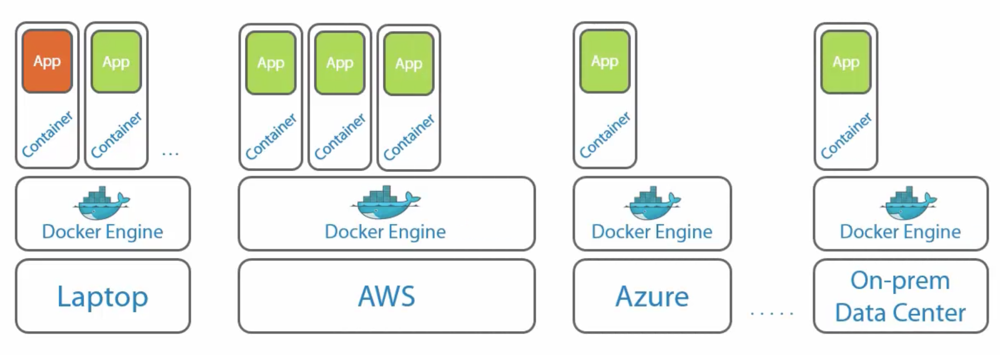

# 容器技术

## 容器技术的概念

**容器技术(Container Technology)**这个概念起步比较早，2000年初Oracle的Solaris系统中就有过类似的解决方案，但近些年来（尤其是2014年Docker出现后），往往被认为是当今虚拟化技术的替代或改进方案。

回顾一下早些年，虚拟化技术，最常见的应用场景就是虚拟机技术——在容器技术大量应用之前，很多情况下我们部署一个应用的常用的方式是开一个虚拟机（也就是跑一个OS），然后在这个虚拟的OS上部署我们的应用。

虚拟化技术很好地实现了程序运行的安全界限，使得我们在同一台机器上部署的应用能够运行在不同的环境下，同时不对全局环境产生影响。

这种解决方案当然理论上没问题，但是实际上会带来如下难题：
1. 虚拟化开销很大，每个虚拟机里的操作系统都需要相当大的开销（操作系统级的性能开销），而且这些开销中很多属于资源浪费（比如一堆没有用到的系统服务），以及大量存储空间的浪费。
2. 不方便操作系统定制化，而且如Windows等操作系统需要考虑官方授权问题。

所以，容器技术就是针对这一问题产生的优化方案，即：
- 部署的应用程序应该真正运行在一个安全隔离的环境下
- 提供应用程序所需要的最小程度的系统服务与一些服务质量控制

## 容器的优势

容器技术从宏观上来讲其实非常类似于虚拟机，只是比虚拟机轻量很多。概念图如下（左为虚拟机，右为容器）：

每个容器好比一个轻量级的操作系统，但是一台宿主机上的所有容器都共享一个系统内核。因为不需要在一个完整虚拟的操作系统上运行，因此容器的虚拟开销相对来说要少很多，而且效率更高，同时可以更好的控制调整计算、存储资源分配。

## 容器实现的基本原理

容器其实可以看做是用户空间(User space)的隔离实例，以Unix/类Unix为例，在同一个根文件系统下，每个容器都拥有自己独立的隔离视图（也就是说，一个容器拥有一个隔离、独立的根目录，但他看不到自己根目录以外的任何目录）。

在传统的Unix上，可以通过chroot这个系统调用（通过修改根目录把用户jail到一个特定目录下），chroot提供了一种简单的隔离模式：chroot内部的文件系统无法访问外部的内容。

前几年新加入Linux内核的Linux Namespace在此基础上，提供了对UTS、IPC、mount、PID、network、User等的隔离机制。有了这些机制，才使得容器技术在Linux上得以实现，同时容器还能拥有自己独立的进程树、网络视图或网络堆栈、权限管理等，同时，我们也能对一个组里的容器进行资源分配动态调整。

可以说，Linux的内核提供了Linux Namespace之后，容器实现起来非常容易。以至于容易到了我们甚至可以[一个119行的shell脚本就能实现一个Docker](https://github.com/p8952/bocker/blob/master/bocker)。

## Docker：可移植性的新高度

**Docker**是一家公司，也指一种容器技术的实现。当然我们要讲的是后者。
Docker其实是把Linux内核提供的Linux Namespace等特性进行了封装之后转换成的一个产品（好比CentOS，Ubuntu之于Linux Kernel）。

Docker提供了一种标准运行环境，使得开发人员在自己的Docker环境下编写/部署好应用并测试通过后，直接将环境打包即可部署到各种云服务平台（如亚马逊、微软Azure等）上的Docker，环境直接几乎一键部署，免去了配置的麻烦。

[Docker Hub](https://hub.docker.com/)就是一个Docker的管理平台，非常类似于Github，我们可以把自己打包好的环境进行版本管理控制。同时，公开的环境可以直接供大家使用、修改，提供了可复用性。

所以说，Docker和容器技术把程序的可移植性提升到了一个新的高度，也是目前云技术复用技术的新方向。

## 参考资料

1. [Docker官网](http://docker.io/)
2. [Docker容器技术内幕](http://www.dbdao.com/docker/docker-introduce-container/)
3. [Docker基础技术：Linux Namespace](http://coolshell.cn/articles/17010.html)
4. [Go语言，Docker和Kubernetes](http://www.yinwang.org/blog-cn/2016/03/27/docker)
