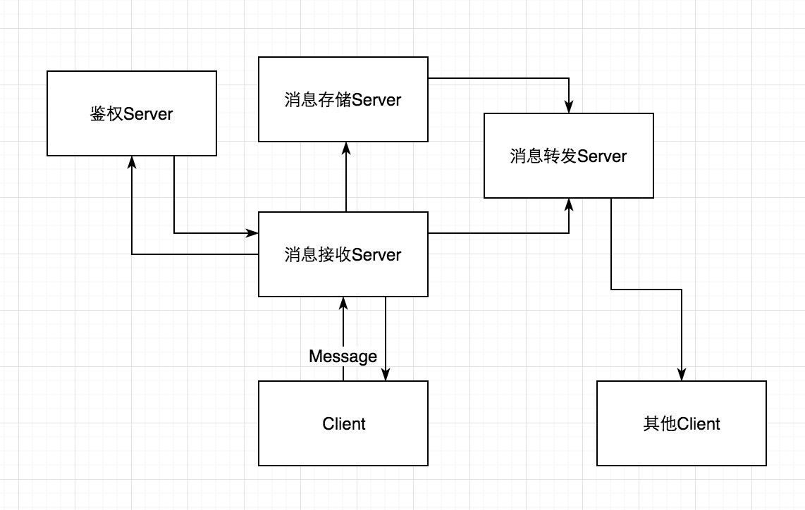

# 需求

将一个完整的Server分拆成如下几个Server:
 1. 鉴权Server
 2. 消息接收Server
 3. 消息存储Server
 4. 消息转发Server

# 思路

就是把一个Server换成多个Server, Client只和消息接收Server交互, 消息接收Server中的License, 存储, 转发功能需要提取出来, 单独做成另外三个Server,
然后每个Server之间仍然通过Message的方式进行交互. 如下图:




所以，对于四个Server之间，我们要实现的是每个Server还附带一个ClientSocket，使得Server之间存在互相通信的功能。

对于各个Server之间，通信所用的Message就是我们需要实现的接口。

# 各个Server应划分到的功能范围

### 消息接收Server

消息接收Server类似于一个中转站，负责与所有Client的直接通讯（比如登录信息的接收、当前所有Session的管理，聊天消息的接收等等）。但是部分功能应来自其他三个Server的支持。

### 鉴权Server

基本上涵盖了License模块提供的功能，管理账号的登录、各个账号对应的的License权限（单次连接最大聊天次数限制，发送聊天频率管理等）。

### 存储Server

涵盖日志、打包加密等模块提供的功能。不直接记录当前连接的所有聊天记录信息，而是由其他三个Server通过Message的方式告知其需要记录的内容。

### 转发Server

负责群聊或私聊时，转发单个用户对其他用户的单播、多播、广播聊天消息，并要求存储Server进行对应聊天日志的存储、离线用户的消息缓存等。

# 各个Server应实现的消息类型接口

#### **ReceivingServerReqLoginMessage** 
- 消息来源：消息接收Server
- 消息发送至：鉴权Server
- 类型继承：BaseMessage
- 功能：接收Server接收到登录请求后，向鉴权Server请求验证登录的用户ID和密码
- 实现范例：
```java
public ReceivingServerReqLoginMessage extends BaseMessage {
	// Base class methods
	/* 请求登录的账号 */
	public Account account;
}
```

#### **AuthServerRespLoginMessage** 
- 消息来源：鉴权Server
- 消息发送至：消息接收Server
- 类型继承：BaseMessage
- 功能：鉴权Server向接收Server的回复验证登录信息
- 实现范例：
```java
public AuthServerRespLoginMessage extends BaseMessage {
	// Base class methods
	/* 请求登录的账号 */
	public Account account;
	/* 是否允许登录 */
	public boolean canLogin;
	/* 拒绝登录原因，如果canLogin为true则该成员变量为null */
	public String denyReason;
}
```

#### **ReceivingServerReqMessage** 
- 消息来源：消息接收Server
- 消息发送至：鉴权Server
- 类型继承：BaseMessage
- 功能：接收Server向鉴权Server请求某个AccountID的权限状态
- 实现范例：
```java
public ReceivingServerReqMessage extends BaseMessage {
	// Base class methods
	/* 请求详细信息的账号ID */
	public String accountId;
}
```

#### **AuthServerRespLicenseMessage** 
- 消息来源：鉴权Server
- 消息发送至：消息接收Server
- 类型继承：BaseMessage
- 功能：鉴权Server向接收Server的回复验证登录信息
- 实现范例：
```java
public AuthServerRespLicenseMessage extends BaseMessage {
	// Base class methods
	/* 请求详细信息的账号ID */
	public String accountId;
	/* License类型 */
	public AccountLicense license;
	/* 该账号ID单次连接允许的最大聊天次数 */
	public int maxChatTimes;
	/* 该账号ID每秒允许的聊天次数 */
	public int maxChatTimesPerSecond;
}
```

#### **ReceiveServerReqStoreMessage** 
- 消息来源：消息接收Server
- 消息发送至：消息存储Server
- 类型继承：BaseMessage
- 功能：接收Server将一段时间内缓存的消息发送至消息存储Server，让其存储在日志中
- 备注：最好以消息缓存的存储容量大小作为开始发送的阈值，如若干分钟后仍未达到阈值，应以一定的时间作为开始发送阈值（以上两者都应可配置）。
- 实现范例：
```java
public ReceiveServerReqStoreMessage extends BaseMessage {
	// Base class methods
	/* 接收Server缓存的聊天消息列表 */
	public List<ChatMessage> chatCacheList;
}
```

#### **StoreServerRespStoreMessage** 
- 消息来源：消息存储Server
- 消息发送至：消息接收Server
- 类型继承：BaseMessage
- 功能：存储Server向接收Server反馈
- 备注：确认存储Server完成存储后，消息接收Server应该删除缓存，防止内存占用过大。
- 实现范例：
```java
public StoreServerRespStoreMessage extends BaseMessage {
	// Base class methods
	/* 确认已经完成存储，如为false时，需要接收Server重发缓存消息列表 */
	public boolean isComplete;
	/* 如果存储失败，失败原因（方便调试），isComplete为true时该成员变量为null */
	public String isComplete;
}
```


#### **ReceiveServerReqTransmitMessage** 
- 消息来源：消息接收Server
- 消息发送至：消息转发Server
- 类型继承：BaseMessage
- 功能：消息接收Server在某个用户需要向其他用户进行多播、广播等情况时，向消息转发Server请求代转发
- 备注：消息转发Server应该在某个负责缓存离线用户的消息，进行持久化存储
- 实现范例：
```java
public ReceiveServerReqTransmitMessage extends BaseMessage {
	// Base class methods
	/* 需转发用户以及对应消息内容的HashMap */
	public HashMap<String, ChatMessage> transmitMessageMap;
	/* 发送方账号ID */
	public String accountId;
}
```

#### **TransmitServerReqStoreMessage** 
- 消息来源：消息转发Server
- 消息发送至：消息存储Server
- 类型继承：BaseMessage
- 功能：类似于ReceiveServerReqStoreMessage，记录转发的消息
- 备注：消息转发Server应该在某个负责缓存离线用户的消息，进行持久化存储
- 实现范例：
```java
public TransmitServerReqStoreMessage extends BaseMessage {
	// Base class methods
	/* 确认已经完成存储，如为false时，需要转发Server重发缓存消息列表 */
	public boolean isComplete;
	/* 如果存储失败，失败原因（方便调试），isComplete为true时该成员变量为null */
	public String isComplete;
}
```

